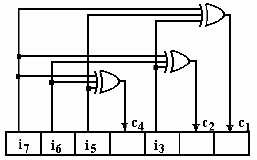

## Chapter IV: Error control coding

### What is error control coding?

{width=40%}

* The second main task of coding: error control 
* Protect information against channel errors

### Mutual information and error control

* Mutual information $I(X,Y)$ = the information transmitted on the channel
* Why do we still need error control?

* Example: consider the following BSC channel (p = 0.01, $p(x_1) = 0.5$, $p(x_2)=0.5$):

{width=25%}

* The receiver would like to know the source messages 
    * In absence of communication, the uncertainty is $H(X) = 1$ bit/msg
    * With communication, the uncertainty is $H(X|Y) \approx 0.081$ bit/msg

### Mutual information and error control

* The reduction in  uncertainty due to communication = mutual information
    * $I(X,Y) = H(X) - H(X|Y) = \approx 0.919$ bit/msg
    
* Even though we have large I(X,Y), we still lose some information
    * Imagine downloading a file, but having $1\%$ wrong bits

###  Why is error control needed?

* In most communications it is required that *all* bits are received correctly
    * Not $1\%$ errors, not $0.1\%$, not $0.0001\%$. **None!**

* But that is not possible unless the channel is ideal.

* So what do to? **Error control coding**

### Modelling the errors on the channel

* We consider only binary channels (symbols = $\left\lbrace 0,1 \right\rbrace$
* An error = a bit is changed from 0 to 1 or viceversa
* Errors can appear:
    * **independently**: each bit on its own
    * in **packets of errors**: groups of errors 

### Modelling the errors on the channel

* Changing the value of a bit = modulo-2 sum with 1
* Value of a bit remains the same = modulo-2 sum with 0
    
{width=50%}

* Channel model we use (simple):
    * The transmitted sequence is summed modulo-2 with an **error sequence**
    * Where the error sequence is 1, there is a bit error
    * Where the error sequence is 0, there is no error
$$\mathbf{r} = \mathbf{c} \oplus \mathbf{e}$$

### Mathematical properties of modulo-2 arithmetic

* Product is the same as for normal arithmetic

* Multiplication is distributive just like in normal case
$$a(b \oplus c) = ab \oplus ac$$

* Subtraction = addition. There is no negativation. Each number is its own negative
$$a \oplus a = 0$$
    
### Error detection vs correction

What can we do about errors?

* **Error detection**: find out if there is any error in the received sequence
    * don't know exactly where, so cannot correct the bits, but can discard whole sequence
    * perhaps ask the sender to retransmit (examples: TCP/IP, internet communication etc)
    * easier to do
* **Error correction**: find out exactly which bits have errors, if any
    * locating the error = correcting error (for binary channels)
    * can correct all errored bits by inverting them
    * useful when can't retransmit (data is stored: on HDD, AudioCD etc.)
    * harder to do than mere detection
    
### Overview of error control coding process

The process of error control:

1. Want to send a sequence of $k$ bits = **information word**
$$\mathbf{i} = i_1i_2...i_k$$

2. For each possible information word, the coder assigns a **codeword** of length $n > k$:
$$\mathbf{c} = c_1c_2...c_n$$

3. The codeword is sent on the channel instead of the original information word

4. The receiver receives a sequence $\hat{\mathbf{c}} \approx \mathbf{c}$, with possible errors:
$$\hat{\mathbf{c}} = \hat{c_1}\hat{c_2}...\hat{c_n}$$

5. The decoding algorithm detects/corrects the errors in $\hat{\mathbf{c}}$

### Definitions

* An **error correcting code** is an association between the set of all possible information words to a set of codewords
    * Each possible information word $\mathbf{i}$ has a certain codeword $\mathbf{c}$
* The association can be done:
    * randomly: codewords are selected and associated randomly to the information words
    * based on a certain rule: the codeword is computed with some algorithm from the information word

* A code is a **block code** if it operates with words of *fixed size*
    * Size of information word $\mathbf{i} = k$, size of codeword $\mathbf{c} = n$, $n > k$
    * Otherwise it is a *non-block code*
    
* A code is **linear** if any linear combination of codewords is also a codeword

* The **coding rate** of a code is:
$$R = k/n$$

### Definitions

* A code $C$ is an **$t$-error-detecting** code if it is able to *detect* $t$ or less errors

* A code $C$ is an **$t$-error-correcting** code if it is able to *correct* $t$ or less errors

* Examples: at blackboard

### A first example: parity bit

* Add parity bit to a 8-bit long information word, before sending on a channel
    * coding rate $R = 8/9$
    * can detect 1 error in a 9-bit codeword
    * detection algorithm: check if parity bit matches data
    * fails for 2 errors
    * cannot correct error (don't know where it is located)
    
* Add more parity bits to be able to locate the error
    * Example at blackboard
    * coding rate $R = 8/12$
    * can detect and correct 1 error in a 9-bit codeword

### A second example: repetition code

* Repeat same block of data $n$ times
    * want to send a $k$-bit information word
    * codeword to send = the information word repeated $n=5$ times
    * coding rate $R = k/n = 1/5$
    * can detect and correct 2 errors, and maybe even more 
    if they do not affect the same bit
    * error correcting algorithm = majority rule
    * not very efficient

### Redundancy

* Because $k < n$, we introduce **redundancy**
    * to transmit $k$ bits of information we actually send more bits ($n$) 
    
* Error control coding adds redundancy, while source coding aims to reduce redundancy --> Contradiction?
    * but now redundancy is added in a controlled way, with a purpose
    
* Source coding and error control coding in practice: do sequentially, independently
    1. First perform source coding, eliminating redundancy in representation of data
    2. Then perform error control coding, adding redundancy for protection

### Shannon's noisy channel theorem (second theorem, channel coding theorem)

* A coding rate is called **achievable** for a channel if, for that rate, there exists a coding and decoding
algorithm guaranteed to correct all possible errors on the channel

#### Shannon's noisy channel coding theorem (second theorem)
For a given channel, all rates below capacity $R < C$ are achievable. All rates
above capacity, $R > C$, are not achievable.

### Channel coding theorem explained

In layman terms:

* For all coding rates $R<C$, **there is a way** to recover the transmitted data perfectly (decoding algorithm will detect and correct
all errors)
* For all coding rates $R>C$, **there is no way** to recover the transmitted data perfectly

Example:

* Send binary digits on a BSC channel with capacity 0.7 bits/message
* For any coding rate $R < 0.7$ there exist an error correction code that allow perfect recovery
    * $R < 0.7$ = for every 7 bits of data, coding adds more than 3 bits, on average
* With less than 3 bits for every 7 bits of data => impossible to recover all data

### Ideas behind channel coding theorem

* The rigorous proof of the theorem is too complex to present
* Key ideas of the proof:
    * Use very long information words, $k \to \infty$
    * Use random codes, compute the probability of having error after decoding
    * If $R < C$, *in average for all possible codes*, the probability of error after decoding goes to 0
    * If the average for all codes goes to 0, there exists at least on code better than the average
    * That is the code we should use
    
* **The theorem does not tell what code to use**, only that some code exists
    * There is no clue of how to actually find the code in practice
    * Only some general principles:
        * using longer information words is better
        * random codewords are generally good
    
* In practice, cannot use infinitely long codewords, so will only get a *good enough* code

### Distance between codewords

Practical ideas for error correcting codes:

* If a codeword $\mathbf{c_1}$ is received with errors and becomes identical to another codeword $\mathbf{c_2}$ ==> cannot detect any errors
    * Receiver will think it received a correct codeword $c_2$ and the information word was $\mathbf{i_2}$, but actually it was $\mathbf{i_1}$
* We want codewords as different as possible from each other
* How to measure this difference? **Hamming distance**

### Hamming distance

* The **Hamming distance** of two binary sequences **a**, **b** of length $n$ = the total number
of bit differences between them
$$d_H(\mathbf{a}, \mathbf{b}) = \sum_{i=1}^N a_i \oplus b_i$$

* We need at least $d_H(a, b)$ bit changes to convert one sequence into another

* It satisfies the 3 properties of a metric function:
    1. $d_H(\mathbf{a},\mathbf{b}) \geq 0 \;\;\; \forall \mathbf{a},\mathbf{b}$, with $d_H(\mathbf{a},\mathbf{b}) = 0 \Leftrightarrow \mathbf{a} = \mathbf{b}$
    2. $d_H(\mathbf{a},\mathbf{b}) = d_H(\mathbf{b},\mathbf{a}), \forall \mathbf{a},\mathbf{b}$
    3. $d_H(\mathbf{a},\mathbf{c}) \leq d_H(\mathbf{a},\mathbf{b}) + d_H(\mathbf{b},\mathbf{c}), \forall \mathbf{a},\mathbf{b},\mathbf{c}$

* The **minimum Hamming distance of a code**, ${d_H}_{min}$ = the minimum Hamming distance
between any two codewords $\mathbf{c_1}$ and $\mathbf{c_2}$

* Example at blackboard

### Nearest-neighbor decoding

Coding:

* Design a code with large ${d_H}_{min}$
* Send a codeword $\mathbf{c}$ of the code
    
Decoding:

* Receive a word $\mathbf{r}$, that may have errors

* Error detecting: 
    * check if $r$ is part of the codewords of the code $C$:
    * if $r$ is part of the code, decide that there have been no errors
    * if $r$ is not a codeword, decide that there have been errors

* Error correcting:
	* if $\mathbf{r}$ is a codeword, decide there are no errors
    * else, choose codeword **nearest** to the received $\mathbf{r}$, in terms of Hamming distance
    * this is known as **nearest-neighbor decoding**
    
### Performance of nearest neighbor decoding

Theorem:

* If the minimum Hamming distance of a code is ${d_H}_{min}$, then:
    1. the code can *detect* up to **${d_H}_{min} - 1$** errors
    2. the code can *correct* up to **$\left\lfloor \frac{{d_H}_{min} - 1}{2} \right\rfloor$** errors using nearest-neighbor decoding

Consequence:

* It is good to have ${d_H}_{min}$ as large as possible
    * This implies longer codewords, i.e. smaller coding rate, i.e. more redundancy

### Performance of nearest neighbor decoding

Proof:

1. at least ${d_H}_{min}$ binary changes are needed to change one codeword into another, ${d_H}_{min} - 1$ is not enough => the errors are detected
2. the received word $\mathbf{r}$ is closer to the original codeword than to any other codeword => nearest-neighbor algorithm will find the correct one
    * because $\left\lfloor \frac{{d_H}_{min} - 1}{2} \right\rfloor$ = less than half the distance to another codeword

Note: if the number of errors is higher, can fail:

* Detection failure: decide that there were no errors, even if they were (more than ${d_H}_{min} - 1$)
* Correction failure: choose a wrong codeword

Example: blackboard

### Linear block codes

* A code is a **block code** if it operates with words of *fixed size*
    * Size of information word $\mathbf{i} = k$, size of codeword $\mathbf{c} = n$, $n > k$
    * Otherwise it is a *non-block code*
    
* A code is **linear** if any linear combination of codewords is also a codeword

* A code is called **systematic** if the codeword contains all the information bits explicitly, unaltered
    * coding merely adds supplementary bits besides the information bits
    * codeword has two parts: the information bits and the parity bits
    * example: parity bit added after the information bits
    
* Otherwise the code is called **non-systematic**
    * the information bits are not explicitly visible in the codeword

* Example: at blackboard

### Generator matrix 

* All codewords for a linear block code can be generated via a **matrix multiplication**:
$$\mathbf{i} \cdot [G] = \mathbf{c}$$

{width=50%}

* $[G]$ = **generator matrix** of size $k \times n$

* Row-wise interpretation:
    * $\mathbf{c}$ = a linear combination of rows in $[G]$
    * The rows of $[G]$ = a *basis* for the linear code

* All operations are done in modulo-2 arithmetic

### Parity check matrix

* Every generator matrix $[G]$ has a complementary **parity-check matrix** $[H]$ such that
$$0 = [H] \cdot [G]^T$$

* How to check if a binary word is a codeword or not?

* For every codeword $\mathbf{c}$ generated with $[G]$:
$$\boxed{ 0 = [H] \cdot \mathbf{c}^T }$$

* Proof:
$$\mathbf{i} \cdot [G] = \mathbf{c}$$
$$[G]^T \cdot \mathbf{i}^T = \mathbf{c}^T$$
$$[H] \cdot \mathbf{c}^T = [H] \cdot [G]^T \cdot \mathbf{i}^T = 0$$

### Parity check matrix

* $[H]$ is the **parity-check matrix**, size = $(n-k) \times n$
* $[G]$ and $[H]$ are related, one can be deduced from the other
* The resulting vector $z = [H] \cdot [c]^T$ is the **syndrome**
* All codewords generated with $[G]$ will produce $0$ when multiplied with $[H]$
* All binary sequences that are not codewords will produce $\neq 0$ when multiplied with $[H]$

* Column-wise interpretation of multiplication:

{width=30%}

### [G] and [H] for systematic codes

* For systematic codes, [G] and [H] have special forms
* Generator matrix
    * first part = identity matrix
    * second part = some matrix $Q$
$$[G]_{k \times n} = [Q_{k \times (n-k)} \;\; I_{k \times k}s]$$

* Parity-check matrix
    * first part = identity matrix
    * second part = same Q, transposed
$$[H]_{(n-k) \times n} = [I_{(n-k) \times (n-k)} \;\; Q^T_{(n-k) \times k}]$$

* Can easily compute one from the other

* Example at blackboard

### Interpretation as parity bits

* The additional bits added by coding are actually just parity bits
    * Proof: write the generation equations (example)

* Generator matrix $[G]$ creates the codeword as:
    * first part = information bits (systematic code, first part of $[G]$ is identity matrix)
    * additional bits = combinations of information bits = *parity bits*

* Parity-check matrix $[H]$ checks if parity bits correspond to information bits
     * Proof: write down the parity check equation (see example)

* If all parity bits match the data, the syndrome $\mathbf{z} = 0$ 
    * otherwise the syndrome $\mathbf{z} \neq 0$ 

* **Generator & parity-check matrices are just mathematical tools
for easy computation & checking of parity bits**

### Syndrome-based error detection

Syndrome-based error **detection** for linear block codes:

1. generate codewords with generator matrix:
$$\mathbf{i} \cdot [G] = \mathbf{c}$$

2. send codeword $\mathbf{c}$ on the channel
3. a random error word $\mathbf{e}$ is applied on the channel
4. receive word $\mathbf{r} = \mathbf{c} \oplus \mathbf{e}$

5. compute **syndrome** of $\mathbf{r}$:
$$\mathbf{z} = [H] \cdot \mathbf{r}^T$$

6. Decide:
    * If $\mathbf{z} = 0$ => $\mathbf{r}$ has no errors
    * If $\mathbf{z} \neq 0$ => $\mathbf{r}$ has errors

### Syndrome-based error correction

Syndrome-based error **correction** for linear block codes:

* Syndrome $\mathbf{z} \neq 0$ => $\mathbf{r}$ has errors, we need to locate them

* The syndrome is the effect only of the error word:
$$\mathbf{z} = [H] \cdot \mathbf{r}^T = [H] \cdot (\mathbf{c}^T \oplus \mathbf{e}^T) = [H] \cdot \mathbf{e}^T$$

7. Create a **syndrome lookup table**:
    * for every possible error word $\mathbf{e}$, compute the syndrome $\mathbf{z} = [H] \cdot \mathbf{e}^T$
    * start with error words with 1 error (most likely), then with 2 errors (less likely), and so on

8. Locate the syndrome $\mathbf{z}$ in the table, read the corresponding error word $\mathbf{\hat{e}}$

9. Find the correct word:
    * adding the error word again will invert the errored bits back to the originals
$$\mathbf{\hat{c}} = \mathbf{r}  \oplus \mathbf{\hat{e}}$$

### Example

Example: at blackboard

### Conditions on [H] for error detection and correction

Conditions for syndrome-based error **detection**:

* We can detect errors if the syndrome is **non-zero**

* To detect a single error: every column of $[H]$ must be non-zero
* To detect two error: sum of any two columns of $[H]$ cannot be zero
    * that means all columns are different
* To detect $n$ errors: sum of any $n$ or less columns of $[H]$ cannot be zero

### Conditions on [H] for error detection and correction

Conditions for syndrome-based error **correction**:

* We can correct errors if the syndrome is **unique**

* To correct a single error: all columns of $[H]$ are different
    * so the syndromes, for a single error, are all different
* To correct $n$ errors: sum of any $n$ or less columns of $[H]$ are all different
    * much more difficult to obtain than for decoding

Rearranging the columns of $[H]$ (the order of bits in the codeword) does not affect performance

### Hamming codes

* A particular class of linear error-correcting codes

* Definition: a **Hamming code** is a linear block code where the columns of $[H]$
are *the binary representation of all numbers from 1 to $2^r-1$*, $\forall r \geq 2$

* Example (blackboard): (7,4) Hamming code

* Systematic: arrange the bits in the codeword, such that the control bits correspond to the columns having a single 1
    * no big difference from the usual systematic case, just a rearrangement of bits
    * makes implementation easier
    
* Example codeword for Hamming(7,4):
$$c_1c_2i_3c_4i_5i_6i_7$$

### Properties of Hamming codes

* From definition of $[H]$ it follows:
    1. Codeword has length $n = 2^r - 1$
    2. $r$ bits are parity bits (also known as ***control bits***)
    3. $k = 2^r-r-1$ bits are information bits

* Notation: **(n,k) Hamming code**
    * n = codeword length = $2^r-1$, 
    * k = number of information bits  = $2^r - r - 1$
    * Example: (7,4) Hamming code, (15,11) Hamming code, $(127,120)$ Hamming code

### Properties of Hamming codes

* Can detect two errors
	* All columns are different => can detect 2 errors
	* Sum of two columns equal to a third => cannot correct 3

**OR**

* Can correct one error
	* All columns are different => can correct 1 error
	* Sum of two columns equal to a third => cannot correct 2
	* Non-systematic: syndrome = error position

**BUT**

* Not simultaneously!
    * same non-zero syndrome can be obtained with 1 or 2 errors, can't distinguish

### Coding rate of Hamming codes

Coding rate of a Hamming code:
$$R = \frac{k}{n} = \frac{2^r - r - 1}{2^r-1}$$

The Hamming codes can correct 1 OR detect 2 errors in a codeword of size $n$

* (7,4) Hamming code: $n = 7$
* (15,11) Hamming code: $n = 15$
* (31,26) Hamming code: $n = 31$

Longer Hamming codes are progressively weaker:

* weaker error correction capability
* better efficiency (higher coding rate)
* more appropriate for smaller error probabilities

### Encoding & decoding example for Hamming(7,4)

See whiteboard.

In this example, encoding is done without the generator matrix $G$, directly with the matrix $H$, by finding the values of the parity bits $c_1$, $c_2$, $c_4$ such that
$$\begin{bmatrix}0\\0\\0\end{bmatrix} = [H] \begin{bmatrix}c_1\\c_2\\i_3\\c_4\\i_5\\i_6\\i_7\end{bmatrix}$$

For a single error, the syndrome **is the binary representation of the location of the error**.

### Circuit for encoding Hamming(7,4)

{width=40%}

* Components:
    * A **shift register** to hold the codeword
    * Logic OR gates to compute the parity bits

### Circuit for decoding Hamming(7,4)

{width=40%}

* Components:
    * A **shift register** to hold the received word
    * Logic OR gates to compute the bits of the syndrome ($z_i$)
    * **Binary decoder**: activates the output corresponding to the binary input value, fixing the error

### SECDED Hamming codes

* Hamming codes can correct 1 error OR can detect 2 errors, but we cannot differentiate the two cases

* Example:

    * the syndrome $\mathbf{z} = [H] \cdot \mathbf{r}^T = \begin{bmatrix}0\\1\\1\end{bmatrix}$ can be caused by:
        * a single error in location 3 (bit $i_3$)
        * two errors in location 1 and 2 (bits $c_1$, bits $c_2$)
    
    * if we know it is a single error, we can go ahead and correct it, then use the corrected data
    * if we know there are two errors, we should NOT attempt to correct them, because we cannot locate the errors correctly

* Unfortunately, it is **not possible to differentiate** between the two cases.

* **Solution?** Add additional parity bit $\rightarrow$ SECDED Hamming codes 

### SECDED Hamming codes

* Add an additional parity bit to differentiate the two cases
    * $c_0$ = sum of all $n$ bits of the codeword

* For (7,4) Hamming codes: $$\mathbf{c_0}c_1c_2i_3c_4i_5i_6i_7$$

* The parity check matrix is extended by 1 row and 1 column
$$\tilde{H} = 
\begin{bmatrix}
1 &1 \\
0 &\mathbf{H} \\
\end{bmatrix}$$

* Known as SECDED Hamming codes
    * **S**ingle **E**rror **C**orrection - **D**ouble **E**rror **D**etection

### Encoding and decoding of SECDED Hamming codes

* Encoding:
    * compute codeword using $\tilde{H}$
    * alternatively, prepend $\mathbf{c_0}$ = sum of all other bits

### Encoding and decoding of SECDED Hamming codes

* Decoding
    * Compute syndrome of the received word using $\tilde{H}$
$$\tilde{\mathbf{z}} = \begin{bmatrix}z_0\\\mathbf{z}\end{bmatrix} = [\tilde{H}] \cdot \mathbf{r}^T$$
    * $z_0$ is an additional bit in the syndrome corresponding to $c_0$
    * $z_0$ tells us whether the received $c_0$ matches the parity of the received word
        * $z_0 = 0$: the additional parity bit $c_0$ matches the parity of the received word
        * $z_0 = 1$: the additional parity bit $c_0$ does not match the parity of the received word

### Encoding and decoding of SECDED Hamming codes

* Decoding (continued):
    * Decide which of the following cases happened:
        * If no error happened: $z_1 = z_2 = z_3 = 0, z_0 = \forall$
        * If 1 error happened: syndrome is non-zero, $z_0 = 1$ (does not match)
        * If 2 errors happened: syndrome is non-zero, $z_0 = 0$ (does match, because the two errors cancel each other out)
        * If 3 errors happened: same as 1, can't differentiate

* Now can simultaneously differentiate between:
    * 1 error: $\rightarrow$ perform correction
    * 2 errors: $\rightarrow$ detect, but do not perform correction
    
* Also, if correction is never attempted, can detect up to 3 errors
    * minimum Hamming distance = 4 (no proof given)
    * don't know if 1 error, 2 errors or 3 errors, so can't try correction
    

### Summary until now

* Systematic codes: information bits + parity bits
* Generator matrix: use to generate codeword
$$\mathbf{i} \cdot [G] = \mathbf{c}$$
* Parity-check matrix: use to check if a codeword
$$0 = [H] \cdot \mathbf{c}^T$$
* Syndrome:
$$\mathbf{z} = [H] \cdot \mathbf{r}^T$$
* Syndrome-based error detection: syndrome non-zero
* Syndrome-based error correction: lookup table
* Hamming codes: $[H]$ contains all numbers $1 ... 2^r - 1$
* SECDED Hamming codes: add an extra parity bit

### Cyclic codes

Definition: **cyclic codes** are a particular class of linear block codes
for which *every cyclic shift of a codeword is also a codeword*

* Cyclic shift: cyclic rotation of a sequence of bits (any direction)

* Are a particular class of linear block codes, so all the theory up to now still applies
    * they have a generator matrix, parity check matrix etc.
    
* But they can be implemented more efficient than general linear block codes (e.g. Hamming)

* Used **everywhere** under the common name **CRC** (**C**yclic **R**edundancy **C**heck)
    * Network communications (Ethernet), data storage in Flash memory

### Binary polynomials

* Every binary sequence $\mathbf{a}$ corresponds to a polynomial $\mathbf{a(x)}$ with binary coefficients
$$a_0a_1...a_{n-1} \rightarrow \mathbf{a(x)} = a_0 \oplus a_1x \oplus ... \oplus a_{n-1}x^{n-1}$$

* Example:
$$10010111 \rightarrow 1 \oplus x^3 \oplus x^5 \oplus x^6 \oplus x^7$$

* From now on, by "codeword" we also mean the corresponding polynomial.

* Can perform all mathematical operations with these polynomials:
    * addition, multiplication, division etc. (examples)

* There are efficient circuits for performing multiplications and divisions.

### Generator polynomial

**Theorem**: 

All the codewords of a cyclic code are multiples of a certain polynomial $g(x)$,
known as **generator polynomial**. 

\ 

Properties of generator polynomial $g(x)$:

* The generator polynomial has first and last coefficient equal to 1.
* The generator polynomial is a factor of $X^n \oplus 1$
* The *degree* of $g(x)$ is $n-k$, where:
    * The codeword = polynomial of degree $n-1$ ($n$ coefficients)
    * The information polynomial = polynomial of degree $k-1$ ($k$ coefficients)
$$ (k-1) + (n-k) = n-1$$
* **The degree of $g(x)$ is the number of parity bits of the code.**

### Finding a generator polynomial

**Theorem**: 

If $g(x)$ is a polynomial of degree $(n-k)$ and is a factor of $X^n \oplus 1$, 
then $g(x)$ generates a $(n,k)$ cyclic code.

Example:

$$1 \oplus x^7 = (1 \oplus x)(1 \oplus x + \oplus x^3)(1 \oplus x^2 \oplus x^3)$$

Each factor generates a code:

* $1 \oplus x$ generates a (7,6) cyclic code
* $1 \oplus x \oplus x^3$ generates a (7,4) cyclic code
* $1 \oplus x^2 \oplus x^3$ generates a (7,4) cyclic code

### Computing the codewords
Start from **information polynomial** with $k$ bits 
$$i(x) = i_0 \oplus i_1x \oplus ... \oplus i_{k-1}x^{k-1}$$

**Non-systematic** codeword generation:

* Codeword = $i(x) \cdot g(x)$

$$\boxed{c(x) = i(x) \cdot g(x)}$$

**Systematic** codeword generation:

$$\boxed{c(x) = b(x) \oplus x^{n-k}i(x)}$$

where $b(x)$ is the remainder of dividing $x^{n-k} i(x)$ to $g(x)$:
$$x^{n-k} i(x) = a(x) g(x) \oplus b(x)$$

* (Proof: at blackboard)

### Proving the cyclic property

We prove that any cyclic shift of a codeword is also a codeword.

Proof: at whiteboard

* Original codeword
$$c_0c_1c_2...c_{n-1} \rightarrow \mathbf{c(x)} = c_0 \oplus c_1x \oplus ... \oplus c_{n-1}x^{n-1}$$

* Cyclic shift to the right by 1 position
$$c_{n-1}c_0c_1...c_{n-2} \rightarrow \mathbf{c'(x)} = c_{n-1} \oplus c_0x \oplus ... \oplus c_{n-2}x^{n-1}$$

* Note that 
$$\begin{split}
\mathbf{c'(x)} 
=& x \cdot \mathbf{c(x)} \oplus c_{n-1}x^n \oplus c_{n-1}\\
=& x \cdot \mathbf{c(x)} \oplus c_{n-1}(x^n \oplus 1)\\
\end{split}$$

Since $\mathbf{c(x)}$ is a multiple of $g(x)$, so is $x \cdot \mathbf{c(x)}$. Also $(x^n \oplus 1)$ is always a multiple of $g(x)$. It follows that their sum $\mathbf{c'(x)}$ is a also a multiple of $g(x)$, which means it is a codeword.

### Cyclic code encoder circuits

* Coding = based on polynomial multiplications and divisions
* Efficient circuits for multiplication / division exist, that can be used for systematic or non-systematic codeword generation (draw on blackboard)

### Circuits for multiplication of binary polynomials

### Operation of multiplication circuits

- The input polynomial is applied at the input, 1 bit at a time, starting from highest degree
- The output polynomial is obtained at the output, 1 bit at a time, starting from highest degree
- Because output polynomial has larger degree, the circuit needs to operate a few more samples until the final result is obtained. During this time the input is 0.
- Examples: at the whiteboard

### Linear analysis of multiplication circuits

- These circuits are **linear time-invariant systems** (remember Digital Signal Processing class?), because they are composed only of summations, multiplication by scalars, and delay blocks.
- Therefore, using the Z transform approach (to come soon in Digital Signal Processing class), the output can be computed based on the graph of the system:
    - Draw the graph of the system: cells become $z^{-1}$ blocks, everything else is the same
    - Every $z^{-1}$ block means a delay of one, which is what a cell does
    - Call the input polynomial is $\mathbf{X(z)}$
    - Call the output polynomial is $\mathbf{Y(z)}$
    - Every $z^{-1}$ block means multiplying with $z^{-1}$
    - Compute the output $\mathbf{Y(z)}$ based on $\mathbf{X(z)}$, from the graph

### Linear analysis of multiplication circuits

We get:
$$Y(z) = X(z) \cdot G(z) \cdot z^{-m},$$
meaning that the **output polynomial  = input polynomial * g(x) polynomial, with a delay of $m$ bits (time samples)**.

The delay of $m$ time samples is caused by the fact that the input polynomial has degree $(k-1)$, but the resulting polynomial has larger degree $(k-1) + m$, therefore we need to wait $m$ more time samples until we get the full result.

### Circuits for division binary polynomials

### Operation of division circuits

- The input polynomial is applied at the input, 1 bit at a time, starting from highest degree
- The output polynomial is obtained at the output, 1 bit at a time, starting from highest degree
- Because output polynomial has smaller degree, the circuit first outputs some zero values, until starting to output the result.
- Examples: at the whiteboard

### Linear analysis of division circuits

- These circuits are also **linear time-invariant systems**, because they are composed only of summations, multiplication by scalars, and delay blocks.
- Therefore, using the Z transform approach, the output can be computed based on the graph of the system:
    - Draw the graph of the system: cells become $z^{-1}$ blocks, everything else is the same
    - Every $z^{-1}$ block means a delay of one, which is what a cell does
    - Call the input polynomial is $\mathbf{X(z)}$
    - Call the output polynomial is $\mathbf{Y(z)}$
    - Every $z^{-1}$ block means multiplying with $z^{-1}$
    - Compute the output $\mathbf{Y(z)}$ based on $\mathbf{X(z)}$, from the graph

### Linear analysis of division circuits

We get:
$$Y(z) = \frac{X(z)}{G(z)}$$
meaning that the **output polynomial  = input polynomial / g(x) polynomial**.

### Cyclic encoder circuit

* Non-systematic cyclic encoder circuit:
    * simply a polynomial multiplication circuit

* A systematic cyclic encoder circuit:
    * more complicated
    * must analyze first Linear Feedback Shift Registers (LFSR) 

### Linear-Feedback Shift Registers (LFSR)

* A **flip-flop**  = a cell holding a bit value (0 or 1)
    * called *"bistabil"* in Romanian
    * operates on the edges of a clock signal

* A **register** = a group of flip-flops, holding multiple bits
    * example: an 8-bit register

* A **shift register** = a register where the output of a flip-flop is connected
to the input of the next one
    - the bit sequence is shifted to the right 
    - has an input (for the first cell)

* A  **linear feedback shift register** (LFSR) =  a shift register for which
the input is a computed as a linear combination of the flip-flops values
    - input = usually a XOR of some cells from the register
    - like a division circuit without any input
    - feedback = all flip-flops, with coefficients $g_i$ in general
    - example at whiteboard

### States and transitions of LFSR

* **State** of the LFSR = the sequence of bit values it holds at a certain 
moment

* The state at the next moment, $S(k+1)$,  can be computed by multiplication
of the current state $S(k)$ with the **companion matrix** (or **transition matrix**) $[T]$:
$$S(k+1) = [T]*S(k)$$

* The companion matrix is defined based on the feedback coefficients $g_i$:
$$T = 
\begin{bmatrix}
0 & 1 & 0 & ... & 0 \\
0 & 0 & 1 & ... & 0 \\
\cdot & \cdot & \cdot & ... & \cdot \\
0 & 0 & 0 & ... & 1 \\
g_0 & g_1 & g_2 & ... & g_{m-1} \\
\end{bmatrix}$$

* Note: reversing the order of bits in the state --> transposed matrix

* Starting at time 0, then the state at time $k$ is:
$$S(k) = [T]^k S(0)$$

### Period of LFSR

* The number of states is finite --> they must repeat at some moment
* The state equal to 0 must not be encountered (LFSR will remain 0 forever)
* The **period** of the LFSR = number of time moments until the state repeats
* If period is $N$, then state at time $N$ is same as state at time $0$:
$$S(N) = [T]^N S(0) = S(0),$$
which means:
$$[T]^N = I_m$$

* Maximum period is $N_{max} = 2^m-1$ (excluding state 0), in this case the
polynomial $g(x)$ is called **primitive polynomial**

### LFSR with inputs

* What if the LFSR has an input added to the feedback (XOR)?
    * example at whiteboard
    * assume the input is a sequence $a_{N-1}, ... a_0$

* Since a LFSR is a **linear circuit**, the effect is added:
$$S(1) = [T] \cdot S(0) + 
\begin{bmatrix}
0\\
0\\
...\\
a_{N-1}
\end{bmatrix}$$

* In general
$$S(k_1) = [T] \cdot S(k) + a_{N-k}\cdot [U],$$
where $[U]$ is:
$$[U] = \begin{bmatrix}
0\\
0\\
...\\
1
\end{bmatrix}$$

### Systematic cyclic encoder circuit

* Draw on whiteboard only (sorry!)

* Initially the LFSR state is 0 (all cells are 0)

* Switch in position I:
    - information bits applied to the output and to the division circuit
    - first bits = information bits, systematic, OK
    - LFSR with feedback and input, input = information bits

* Switch in position II:
    - LFSR with feedback and input, input = feedback
    - output bits are also applied to the input of the division circuit

* In the end all cells end up in 0, so ready for next encoding
    - because the input and feedback cancel each other (are identical)

### Systematic cyclic encoder circuit

* Why is the result the desired codeword?

* The output polynomial $c(x)$:
    1. has the information bits in the first part (systematic)
    2. is a multiple of $g(x)$
==> therefore it is the systematic codeword for the information bits

* the output $c(x)$ is a multiple of $g(x)$ because:
    * the output is always applied also t the input of the division circuit
    * after division, the cells end up in 0 <=> no remainder <=> so $c(x)$ is a multiple $g(x)$

* Side note: we haven't really explained *why* the constructed output $c(x)$ is a codeword, but we *proved* that it is so, and this is enough

### The parity-check matrix for systematic cyclic codes

* Cyclic codes are linear block codes, so they have a parity-check and a generator matrix
    * but it is more efficient to implement them with polynomial multiplication / division circuits

* The parity-check matrix $[H]$ can be deduced by analyzing the states of the LFSR
    * it is a LFSR with feedback and input
    * the input is the codeword $c(x)$
    * do computations at whiteboard ...
    * ... arrive at expression for matrix $[H]$

### The parity-check matrix for systematic cyclic codes

* The parity check matrix $[H]$ has the form
$$[H] = [U, TU, T^2U, ... T^{n-1}U]$$

* The cyclic codeword satisfies the usual relation
$$S(n) = 0 = [H] \mathbf{c^T}$$ 

* In case of error, the state at time $n$ will be the syndrome (non-zero):
$$S(n) = [H] \mathbf{r^T} \neq 0$$

### Cyclic decoder implemented with LFSR

* Implement a 1-error-correcting cyclic decoder using LFSRs
* Draw schematic at whiteboard only (sorry!)
* Contents of schematic:
    - main shift register MSR
    - main switch SW
    - 2 LFSRs (divider circuits) after $g(x)$
    - 2 error locator blocks, one for each divider
    - 2 validation gates V1, V2, for each divider
    - output XOR gate for correcting errors

### Cyclic decoder implemented with LFSR

* Operation phases:

1. Input phase: SW on position I, validation gate V1 blocked
    - The received codeword $r(x)$ is received one by one, starting with largest power of $x^n$
    - The received codeword enters the MSR and first LFSR (divider)
    - The first divider computes $r(x) : g(x)$
    - The validation gate V1 is blocked, no output

* Input phase ends after $n$ moments, the switch SW goes into position II
* If the received word has no errors, all LFSR  cells are 0 (no remainder),
will remain 0, the error locator will always output 0

### Cyclic decoder implemented with LFSR

2. Decoding phase: SW on position II, validation gate V1 open
    - LFSR keeps running with no input for $n$ more moments
    - the MSR provides the received bits at the output, one by one
    - **exactly when the erroneous bit is at the main output of MSR, the error locator will output 1, and the output XOR gate will correct the bit (TO BE PROVEN)**
    - during this time the next codeword is loaded into MSR and into second LFSR (input phase for second LFSR)

* After $n$ moments, the received word is fully decoded and corrected
* SW goes back into position I, the second LFSR starts decoding phase, while the first LFSR is loading the new receiver word, and so on

* **To prove:** error locator outputs 1 exactly when the erroneous bit is at the main output

### Cyclic decoder implemented with LFSR

**Theorem:** if the $k$-th bit $r_{n-k}$ from $r(x)$ has an error, the error locator will output 1 exactly after $k-1$ moments

* The $k$-th bit will be output from MSR after $k-1$ moments, i.e. exactly when the error locator will output 1 --> will correct it

* **Proof:**
    1. assume error on position $r_{n-k}$
    2. the state of the LFSR at end of phase I = syndrome = column $(n-k)$ from $[H]$
    $$S(n) = [H]\mathbf{r}^T = [H] \mathbf{e}^T = T^{n-k}U$$
    3. after another $k-1$ moments, the state will be
    $$T^{k-1}T^{n-k}U = T^{n-1}U$$
    4. since $T^n = I_n$ --> $T^{n-1} = T^{-1}$
    5. $T^{-1}U$ is the state preceding state U, which is state
    $$\begin{bmatrix} 1 \\ 0 \\ ... \\ 0 \end{bmatrix}$$

### Cyclic decoder implemented with LFSR

* Step 5 above can be shown in two ways:
    - reasoning on the circuit
    - using the definition of $T^{-1}$

$$T = 
\begin{bmatrix}
g_1 & g_2 & ...g_{m-1} & 1 \\
1 & 0 & ... & 0 & 0 \\
0 & 1 & ... & 0 & 0\\
\cdot & \cdot & \cdot & ... & \cdot \\
0 & 0 & ... & 1 & 0 \\
\end{bmatrix}$$

* The error locator is designed to detect this state $T^{-1}U$, 
i.e. it is designed as shown

* Therefore, the error locator will correct an error
* This works only for 1 error, due to proof (1 column from [H])

### Thresholding cyclic decoder

* A different variant of cyclic decoder

* Consider the parity check matrix $[H]$ of the cyclic code

* Perform **elementary transformations** on $[H]$ to obtain a **reduced** matrix $[H_R]$ such that:
    - last column contains only 1's
    - all other columns contain a single 1 somewhere

* **Elementary transformation** = summation of two rows

* Some rows can be deleted if they cannot be put into required form
--> 
the matrix $[H_R]$ will have $J$ rows (the more the better)

* Denote with $A_j$ the entries of the resulting vector:
$$A = \begin{bmatrix}A_1 \\ A_2 \\ .. \\ A_J \end{bmatrix} = [H_R] r^T$$

### Thresholding cyclic decoder

* Because a codeword $c^T$ produces 0 when multiplied with $[H]$, it will
produce 0 when multiplied with $[H_R]$ also
    * because rows of $[H_R]$ = summation of rows of $[H]$, but $c^T$ makes 
    a 0 with all of them

* Then
$$A = [H_R] r^T = [H_R] (c+e)^T = [H_R] e^T$$

* $e^T$ is the error word having 1's where errors are

* Consider how many of the entries $A_k$ are equal to 1
    * If there is just one error on last position of $e$, **all** $A_k$ are 1
    * If there is just one error on some other position (non-last), only 
    a **single** $A_k$ is 1

### Thresholding cyclic decoder

* **Theorem:** If there are at most $\left \lfloor \frac{J}{2} \right \rfloor$ errors in $e$, then

    * if $\sum A_k > \left \lfloor \frac{J}{2} \right \rfloor$, then there is an error on last position
    * if $\sum A_k \leq \left \lfloor \frac{J}{2} \right \rfloor$, then there is no error on last position

* So we can **reliably** detect an error on last position even though there
might be errors on other positions

* **Proof:**
    * if no error is on last position, at most $\left \lfloor \frac{J}{2} \right \rfloor$ sums $A_k$ are equal to 1
    * if there is error on last position, then there are less than half errors on other position, so less then half $A_k$'s are 0

* Because the code is cyclic, we can rotate the codeword so that next bit is last one --> compute again and decide for second bit, and so on for all

### Thresholding cyclic decoder

* Draw schematic on whiteboard only (sorry!)
* Contents:
    * a cyclic shift register 
    * circuits for computing the sums $A_k$
    * *adder and comparator* that adds all $A_j$ and compares sum
    with $\left \lfloor \frac{J}{2} \right \rfloor$
    * output XOR gate for correcting the error

* Operation
    * received word is loaded into shift register
    * compute $A_j$, decide and correct error on first bit (last position)
    * word rotates cyclically, do the same on next bit
    * and so on until all bits have been on last position and corrected

### Packets of errors

* Until now, we considered a single error
* If errors appear **independently** in a long data sequence, they will
be typically rare --> only one error in a codeword is likely
* So a single error may be good enough for random errors

But:

* In real life, many times the errors appear in packets
* A **packet of errors** (*an error burst*) is a sequence of two or more
**consecutive errors**
    * examples: fading in wireless channels

*  The **length**  of the packet = the number of consecutive errors

### Condition on columns of [H]

* Consider $e$ errors in a codeword

Conditions on the parity-check matrix $[H]$:

* Error **detection** of $e$ independent errors
    * sum of **any** $e$ or fewer columns is **non-zero**
* Error **detection** of a packet of $e$ errors
    * sum of any **consecutive** $e$ or fewer columns is **non-zero**
* Error **correction** of $e$ independent errors
    * sum of **any** $e$ or fewer columns is **unique**
* Error **correction** of a packet of $e$ errors
    * sum of any **consecutive** $e$ or fewer columns is **unique**

### Detection of packets of errors

**Theorem**:

Any (n,k) cyclic codes is capable of detecting any error packet of length $n-k$ or less

* In other words: remainder after division with $g(x)$ is always non-zero

* A large fraction of longer bursts can also be detected (but not all)

* No proof (too complicated)

### Correction of packets of errors

* More difficult to analyze in general, will consider **only the case of packets two errors**

* Cyclic encoder: identical! (might need a longer $g(x)$ though)

* Cyclic decoder with LFSR: similar, but **error locator must be changed**

### Cyclic decoder for packets of 2 errors or less

* Similar schematic, but **error locator** is changed

* Operation is identical

* Error locator:

    * Assume the error word has errors on positions $(n-k)$ and $(n-k-1)$

    * After phase I, the state of the LFSR = column $(n-k)$ + column $(n-k-1)$ 
    $$S(n) = T^{n-k}U \oplus T^{n-k-1}U$$

    * After $k-1$ samples, the first erroneous bit is at the output, and the state is
    $$S(n+k-1) = T^{-1}U \oplus T^{-2}U = \begin{bmatrix} 0 \\ 1 \\ ... \\ 0 \end{bmatrix}$$

    * At the next sample, the state will be 
    $$S(n+k) = T^{-1}U = \begin{bmatrix} 1 \\ 0 \\ ... \\ 0 \end{bmatrix}$$

### Design of error locator

* The error locator must detect these two states --> draw on whiteboard

* If only a single error appears --> also works

### Summary of cyclic codes

* Generated using a generator polynomial $g(x)$
* Non-systematic:
$$c(x) = i(x) \cdot g(x)$$
* Systematic:
$$c(x) = b(x) \oplus X^{n-k}i(x)$$
    *  $b(x)$ is the remainder of dividing $X^{n-k} i(x)$ to $g(x)$

* A codeword is always a multiple of $g(x)$
* Error detection: divide by $g(x)$, look at remainder
* Schematics:
    * Cyclic encoder
    * Cyclic decoder with LFSR
    * Thresholding cyclic decoder
    * Encoder/decoder for packets of up to 2 errors
